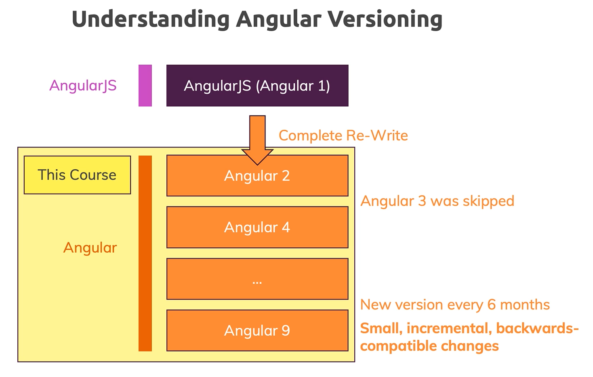

## Angular簡介

* JavaScript Framework，Framework 的好處有以下幾點 :
    - 在過去前端畫面有所變化時，多數時候是自己手動抓取 DOM 物件來取得資料，然而 Framework 可以幫忙省略此動作，這會省掉不少功夫。
    - 前端的框架通常都是由 SPA 架構，一開始 loading 時會將所有前端相關操作的 JavaScript 程式碼載入進來，而所有看似導頁的功能，其實是使用 JavaScript 來進行渲染的 ( 最簡單的檢查方法，就是在網頁上按下右鍵，檢視網頁原始碼 )。
    - 大型的前端開發團隊，如果擁有前端框架的輔助，可幫忙統一整個團隊的開發模式。

    > JavaScript Framework 的好處 : https://owlypixel.com/javascript-framework-benefits/
    > 前端框架的使用者比較 : https://2019.stateofjs.com/front-end-frameworks/
* Angular 的版本 :
    
    這張圖是從 Udemy 截下來的圖片，去查資料會發現 AngularJS 是最原始的 Angular 版本，從 2010 年發行，然而當初推出來後，有發現諸多問題，因此在 2016 年時，推出了新的 Angular，並且維持每半年做一次更新的步驟，到現在為止已經進展到 Angular 11，預計於 2021/05 時推出 Angular 12。

    雖說有不少版本更新，但基本的語法並沒有多少改變，至少都有向前相容，多數都是新增一些 feature。

