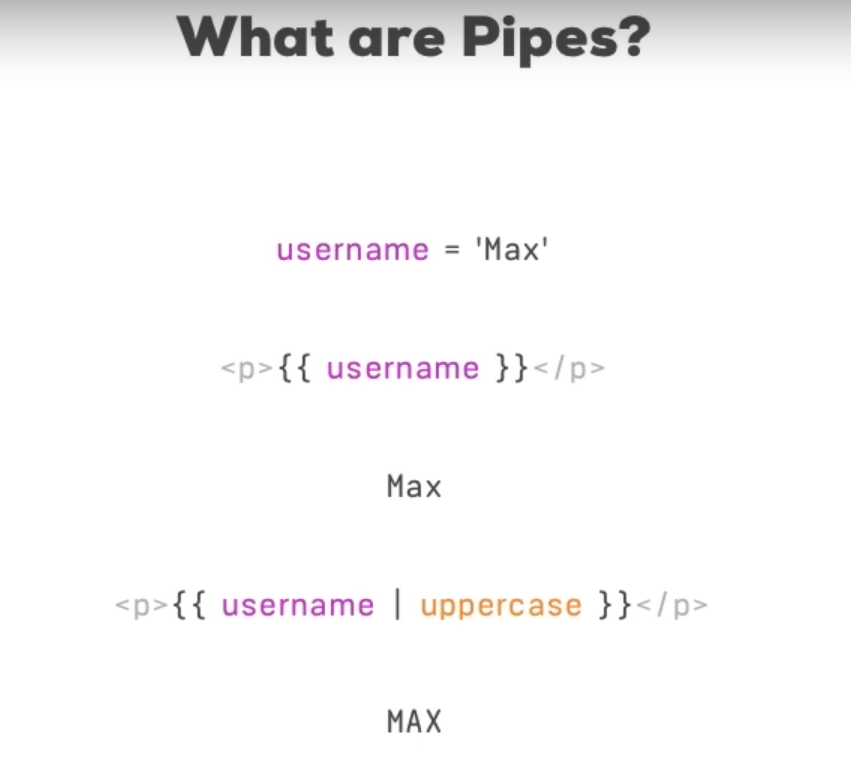

## Pipe



這是從 Udemy 截下來的圖片，它想舉一個例子，假設在 TypeScript 中有一個 `Max` 字串，希望在畫面 render 時全部都是大寫，但又不希望改變 `Max` 這個值 TypeScript 中還是保留本來的狀態，這時就會使用 Pipe 的語法。

### Template 中改變呈現樣式

```
|--app
    |--app.component.html // 更動
```

``` html
<div class="container">
  <div class="row">
    <div class="col-xs-12 col-sm-10 col-md-8 col-sm-offset-1 col-md-offset-2">
      <ul class="list-group">
        <li
          class="list-group-item"
          *ngFor="let server of servers"
          [ngClass]="getStatusClasses(server)">
          <span
            class="badge">
            {{ server.status }}
          </span>
          <strong>{{ server.name }}</strong> |
          {{ server.instanceType | uppercase }} |
          {{ server.started | date}}
        </li>
      </ul>
    </div>
  </div>
</div>
```

Pipe 的語法是為了在 Template 中改變樣式而存在的語法，因此這段程式理所當然的會寫在 Template 中，使用上就在 Interpolation 中加上 `|` 以及想要轉變的型態即可。

### Pipe 中加入參數改變呈現形式

```
|--app
    |--app.component.html // 更動
```

``` html
<div class="container">
  <div class="row">
    <div class="col-xs-12 col-sm-10 col-md-8 col-sm-offset-1 col-md-offset-2">
      <ul class="list-group">
        <li
          class="list-group-item"
          *ngFor="let server of servers"
          [ngClass]="getStatusClasses(server)">
          <span
            class="badge">
            {{ server.status }}
          </span>
          <strong>{{ server.name }}</strong> |
          {{ server.instanceType | uppercase }} |
          {{ server.started | date: 'fullDate'}}
        </li>
      </ul>
    </div>
  </div>
</div>
```

這邊的範例則是在 Pipe 中額外加入其他參數，讓它改變呈現的樣式，如果要看參數怎麼設定可以直接參考 Angular 官網。

### Multiple Pipe

而除了單一個 Pipe 外，還可以將好幾個 Pipe 連續串接在一起，使用 Pipe 時程式碼是由左而右運行 :

```
|--app
    |--app.component.html // 更動
```

``` html
<div class="container">
  <div class="row">
    <div class="col-xs-12 col-sm-10 col-md-8 col-sm-offset-1 col-md-offset-2">
      <ul class="list-group">
        <li
          class="list-group-item"
          *ngFor="let server of servers"
          [ngClass]="getStatusClasses(server)">
          <span
            class="badge">
            {{ server.status }}
          </span>
          <strong>{{ server.name }}</strong> |
          {{ server.instanceType | uppercase }} |
          {{ server.started | date: 'fullDate' | uppercase}}
        </li>
      </ul>
    </div>
  </div>
</div>
```

### 客製化 Pipe

使用指令 `ng g p pipe/shorten --spec false`，這樣 Angular CLI 會產出一個能讓我們客製化 Pipe 的 TypeScript 檔，接著來改寫裡面的內容 :

```
|--app
    |--app.component.html // 更動
    |--pipe
        |--shorten.pipe.ts // 更動
```

``` TypeScript
@Pipe({
  name: 'shorten'
})
export class ShortenPipe implements PipeTransform {
  transform(value: any) {
    if(value.length > 10) {
      return value.substr(0, 10) + '...';
    }
    return value;
  }
}
```

``` html
<div class="container">
  <div class="row">
    <div class="col-xs-12 col-sm-10 col-md-8 col-sm-offset-1 col-md-offset-2">
      <ul class="list-group">
        <li
          class="list-group-item"
          *ngFor="let server of servers"
          [ngClass]="getStatusClasses(server)">
          <span
            class="badge">
            {{ server.status }}
          </span>
          <strong>{{ server.name | shorten}}</strong> |
          {{ server.instanceType | uppercase }} |
          {{ server.started | date: 'fullDate' | uppercase}}
        </li>
      </ul>
    </div>
  </div>
</div>
```

Template 的部分就單純的使用自己定義好的 Pipe，而 TypeScript 的內容相對做了比較多的改動，第一個是在上面有 `@Pipe(..)` 的 Decorator，並且指定它的 name 屬性讓外部的其他 Component 可以抓到，第二個是必須實作 `PipeTransform` 這個介面，並且實作內部的 `transform(..)`，`transform(..)` 預設上可以有兩個參數，第一個參數是想要 transform 的變數，第二個參數則是看要不要對它做參數化，目前先忽略第二個參數。

### 參數化客製的 Pipe

再來則是嘗試加入第二個參數，用這第二個參數進行參數上的調變 :

```
|--app
    |--app.component.html // 更動
    |--pipe
        |--shorten.pipe.ts // 更動
```

``` TypeScript
@Pipe({
  name: 'shorten'
})
export class ShortenPipe implements PipeTransform {
  transform(value: any, limit: number) {
    if(value.length > limit) {
      return value.substr(0, limit) + '...';
    }
    return value;
  }
}
```

``` html
<div class="container">
  <div class="row">
    <div class="col-xs-12 col-sm-10 col-md-8 col-sm-offset-1 col-md-offset-2">
      <ul class="list-group">
        <li
          class="list-group-item"
          *ngFor="let server of servers"
          [ngClass]="getStatusClasses(server)">
          <span
            class="badge">
            {{ server.status }}
          </span>
          <strong>{{ server.name | shorten: 5}}</strong> |
          {{ server.instanceType | uppercase }} |
          {{ server.started | date: 'fullDate' | uppercase}}
        </li>
      </ul>
    </div>
  </div>
</div>
```

### 製作簡單的 Filter

這段相對起來比較沒有用到新的語法，不過是利用 Pipe 來製作一個 Filter，首先使用指令 `ng g p filter pipe/filter --spec false`，再來開始對檔案做些改動 :

```
|--app
    |--app.component.ts // 更動
    |--app.component.html // 更動
    |--pipe
        |--filter.pipe.ts // 更動
```

``` html
<div class="container">
  <div class="row">
    <div class="col-xs-12 col-sm-10 col-md-8 col-sm-offset-1 col-md-offset-2">
      <input type="text" [(ngModel)]="filterStatus">
      <hr>
      <ul class="list-group">
        <li
          class="list-group-item"
          *ngFor="let server of servers | filter : filterStatus : 'status'"
          [ngClass]="getStatusClasses(server)">
          <span
            class="badge">
            {{ server.status }}
          </span>
          <strong>{{ server.name | shorten: 5}}</strong> |
          {{ server.instanceType | uppercase }} |
          {{ server.started | date: 'fullDate' | uppercase}}
        </li>
      </ul>
    </div>
  </div>
</div>
```

``` TypeScript
export class AppComponent {
  servers = [
    {
      instanceType: 'medium',
      name: 'Production Server',
      status: 'stable',
      started: new Date(15, 1, 2017)
    },
    {
      instanceType: 'large',
      name: 'User Database',
      status: 'stable',
      started: new Date(15, 1, 2017)
    },
    {
      instanceType: 'small',
      name: 'Development Server',
      status: 'offline',
      started: new Date(15, 1, 2017)
    },
    {
      instanceType: 'small',
      name: 'Testing Environment Server',
      status: 'stable',
      started: new Date(15, 1, 2017)
    }
  ];
  filterStatus = '';
  getStatusClasses(server: {instanceType: string, name: string, status: string, started: Date}) {
    return {
      'list-group-item-success': server.status === 'stable',
      'list-group-item-warning': server.status === 'offline',
      'list-group-item-danger': server.status === 'critical'
    };
  }
}
```

``` TypeScript
@Pipe({
  name: 'filter'
})
export class FilterPipe implements PipeTransform {

  transform(value: any, filterString: string, propName: string): any {
    if(value.length == 0){
      return value;
    }
    const resultArray = [];
    for(const item of value){
      if(item[propName] === filterString){
        resultArray.push(item);
      }
    }
    return resultArray;
  }
}
```

首先在 `AppComponent` 中加入 `filterStatus`，並利用雙向綁定與 template 中的 `<input>` 綁定在一起，再來看到 filter 的部分，這部分主要想做的是將陣列中符合傳入參數的值給留下來，因此第二個參數放入的是要過濾出來的字串、第三個參數則是放入想要過濾的物件。再來看到 template 的部分，在使用 `*ngFor` 的地方就使用了這個 Pipe 將其先進行過濾，可以看到如果打上 `AppComponent` 中物件有的值，`*ngFor` 就會將其迭代出來。

### `pure`

```
|--app
    |--app.component.ts // 更動
    |--app.component.html // 更動
    |--pipe
        |--filter.pipe.ts // 更動
```

``` TypeScript
export class AppComponent {
  servers = [
    {
      instanceType: 'medium',
      name: 'Production Server',
      status: 'stable',
      started: new Date(15, 1, 2017)
    },
    {
      instanceType: 'large',
      name: 'User Database',
      status: 'stable',
      started: new Date(15, 1, 2017)
    },
    {
      instanceType: 'small',
      name: 'Development Server',
      status: 'offline',
      started: new Date(15, 1, 2017)
    },
    {
      instanceType: 'small',
      name: 'Testing Environment Server',
      status: 'stable',
      started: new Date(15, 1, 2017)
    }
  ];
  filterStatus = '';
  getStatusClasses(server: {instanceType: string, name: string, status: string, started: Date}) {
    return {
      'list-group-item-success': server.status === 'stable',
      'list-group-item-warning': server.status === 'offline',
      'list-group-item-danger': server.status === 'critical'
    };
  }
  onAddServer() {
    this.servers.push({
      instanceType: 'small',
      name: 'New Server',
      status: 'stable',
      started: new Date(15, 1, 2017)
    });
  }
}
```

``` html
<div class="container">
  <div class="row">
    <div class="col-xs-12 col-sm-10 col-md-8 col-sm-offset-1 col-md-offset-2">
      <input type="text" [(ngModel)]="filterStatus">
      <br>
      <button class="btn btn-primary" (click)="onAddServer()">Add Server!</button>
      <hr>
      <ul class="list-group">
        <li
          class="list-group-item"
          *ngFor="let server of servers | filter : filterStatus : 'status'"
          [ngClass]="getStatusClasses(server)">
          <span
            class="badge">
            {{ server.status }}
          </span>
          <strong>{{ server.name | shorten: 5}}</strong> |
          {{ server.instanceType | uppercase }} |
          {{ server.started | date: 'fullDate' | uppercase}}
        </li>
      </ul>
    </div>
  </div>
</div>
```

``` TypeScript
@Pipe({
  name: 'filter',
  pure: false
})
export class FilterPipe implements PipeTransform {

  transform(value: any, filterString: string, propName: string): any {
    if(value.length == 0){
      return value;
    }
    const resultArray = [];
    for(const item of value){
      if(item[propName] === filterString){
        resultArray.push(item);
      }
    }
    return resultArray;
  }
}
```

Pipe 在預設上，物件就算有所變動也不會去觸發 Pipe 的內容，只有當 Pipe 的參數有所變動，才會在重新刷新 Pipe 的內容，這主要是效能上的考量，然而如果將 `@Pipe` 內部中的 `pure` 改成 `false`，就會更改這樣的機制。

### `async`

最後要介紹最常使用的 Pipe，它可以幫忙把已經變成 `fulfillment` 的 Promise 解析出來，已及將訂閱到的 Observable 解析出來，並不會在一開始就解析物件而得到 `[Object object]` 的字串 :

```
|--app
    |--app.component.ts // 更動
    |--app.component.html // 更動
```
 
``` TypeScript
export class AppComponent {
  appStatus = new Promise((resolve, reject) => {
    setTimeout(function(){
      resolve('stable')
    }, 2000)
  })
  servers = [
    {
      instanceType: 'medium',
      name: 'Production Server',
      status: 'stable',
      started: new Date(15, 1, 2017)
    },
    {
      instanceType: 'large',
      name: 'User Database',
      status: 'stable',
      started: new Date(15, 1, 2017)
    },
    {
      instanceType: 'small',
      name: 'Development Server',
      status: 'offline',
      started: new Date(15, 1, 2017)
    },
    {
      instanceType: 'small',
      name: 'Testing Environment Server',
      status: 'stable',
      started: new Date(15, 1, 2017)
    }
  ];
  filterStatus = '';
  getStatusClasses(server: {instanceType: string, name: string, status: string, started: Date}) {
    return {
      'list-group-item-success': server.status === 'stable',
      'list-group-item-warning': server.status === 'offline',
      'list-group-item-danger': server.status === 'critical'
    };
  }
  onAddServer() {
    this.servers.push({
      instanceType: 'small',
      name: 'New Server',
      status: 'stable',
      started: new Date(15, 1, 2017)
    });
  }
}
```

``` html
<div class="container">
  <div class="row">
    <div class="col-xs-12 col-sm-10 col-md-8 col-sm-offset-1 col-md-offset-2">
      <input type="text" [(ngModel)]="filterStatus">
      <br>
      <button class="btn btn-primary" (click)="onAddServer()">Add Server!</button>
      <br><br>
      <h2>App Status: {{appStatus|async}}</h2>
      <hr>
      <ul class="list-group">
        <li
          class="list-group-item"
          *ngFor="let server of servers | filter : filterStatus : 'status'"
          [ngClass]="getStatusClasses(server)">
          <span
            class="badge">
            {{ server.status }}
          </span>
          <strong>{{ server.name | shorten: 5}}</strong> |
          {{ server.instanceType | uppercase }} |
          {{ server.started | date: 'fullDate' | uppercase}}
        </li>
      </ul>
    </div>
  </div>
</div>
```