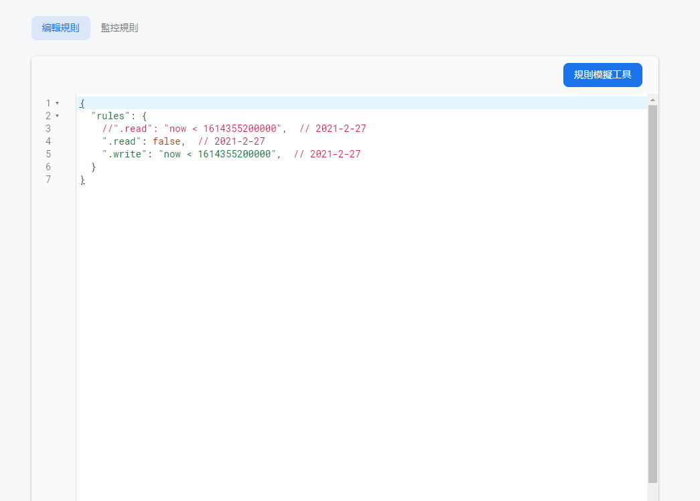
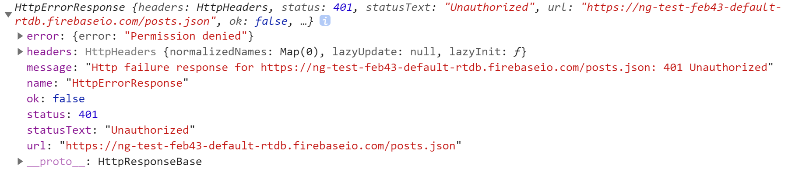

## Http Request

### 簡介 Http Request


這是 Udemy 上截來的圖片，多數時候會從後端取得資料，而因為 Angular 是屬於前端的框架，也就是說所有的東西都會送到瀏覽器也就是客戶端，也因此取得資料不會直接去連 DB，這會有安全性問題，而是有 API 供 Angular 使用，並由這個 API 取得後端 DB 資料。


這張圖解釋 Http Request 裡面會包含的內容，Http 是種通訊協定，Angular 利用此通訊協定與 API 端進行資料的交換，這個通訊協定基本上有幾個必須帶有的東西，第一個會是 Request 的動作 ( 可能是 GET、POST、DELETE...)，第二個 URL 是 API 的位址，第三個 Http Headers 是要解析此 Http Headers 需要的資訊 ( 像 Content-Type 是 json 就是解析 body 用 json 格式來解析 )，第四個 Body 則是發送 request 時內部會帶有的資料。

### 利用 FireBase 創建簡單的後端 API

FireBase 是 Google 提供的工具，先用它來當作簡單的後端 API，首先直接使用 Google 帳號來登入 :


進到 FireBase 後按下新增專案來新增新的 API，再來點進這個專案來看看內部配置的 URL :


點進去之後直接來看左邊的 Realtime Database，一開始點進來會問要使用鎖定模式還是測試模式，先選擇測試模式，再來會進到上面的畫面。如果這些東西都配置完成後，就可以開始在程式碼中嘗試打 API。

### 發送 POST 請求

``` 
|--app
    |--app.component.html // 更動
    |--app.component.ts // 更動
    |--app.module.ts // 更動
```

``` html
<div class="container">
  <div class="row">
    <div class="col-xs-12 col-md-6 col-md-offset-3">
      <form #postForm="ngForm" (ngSubmit)="onCreatePost(postForm.value)">
        <div class="form-group">
          <label for="title">Title</label>
          <input
            type="text"
            class="form-control"
            id="title"
            required
            ngModel
            name="title"
          />
        </div>
        <div class="form-group">
          <label for="content">Content</label>
          <textarea
            class="form-control"
            id="content"
            required
            ngModel
            name="content"
          ></textarea>
        </div>
        <button
          class="btn btn-primary"
          type="submit"
          [disabled]="!postForm.valid"
        >
          Send Post
        </button>
      </form>
    </div>
  </div>
  <hr />
  <div class="row">
    <div class="col-xs-12 col-md-6 col-md-offset-3">
      <button class="btn btn-primary" (click)="onFetchPosts()">
        Fetch Posts
      </button>
      |
      <button
        class="btn btn-danger"
        [disabled]="loadedPosts.length < 1"
        (click)="onClearPosts()"
      >
        Clear Posts
      </button>
    </div>
  </div>
  <div class="row">
    <div class="col-xs-12 col-md-6 col-md-offset-3">
      <p>No posts available!</p>
    </div>
  </div>
</div>
```

``` TypeScript
@NgModule({
  declarations: [AppComponent],
  imports: [BrowserModule, FormsModule, HttpClientModule],
  providers: [],
  bootstrap: [AppComponent]
})
export class AppModule {}
```

``` TypeScript
export class AppComponent implements OnInit {
  loadedPosts = [];

  constructor(private http: HttpClient) { }

  ngOnInit() { }

  onCreatePost(postData: { title: string; content: string }) {
    this.http
      .post(
        'your url here!!!',
        postData
      )
      .subscribe(responseData => {
        console.log(responseData);
      });
  }

  onFetchPosts() {
    // Send Http request
  }

  onClearPosts() {
    // Send Http request
  }
}
```

想要發送 Http Request 必須先在 `AppModule` 中 import `HttpClientModule`，import 後就可以在其他 Component 注入 `HttpClient`，並使用 `HttpClient` 來發送 GET、POST......等請求。這個 POST method 中帶有兩個參數，第一個參數是發送請求的 URL ( 直接貼上 FireBase 的 URL，並在後面補上 `posts.json`，這是屬於 FireBase 的設定，現階段不必糾結為何要加 `posts.json` )，第二個參數是要送到後端的 Json 資料，當發送請求後會在 FireBase 這端拿到送過來的資料 :


在發送 POST 請求後會拿到 Observable 物件，必須對它進行 `subscribe(..)` 來進行操作，這邊先把資料印出來即可，這時前端可以拿到 POST 請求儲存資料成功而得到的回應。

### 發送 GET 請求

除了 POST 請求將值存到 FireBase 中，也可以使用 GET 請求將 FireBase 中的值給取出來 :

``` 
|--app
    |--app.component.ts // 更動
```

``` TypeScript
export class AppComponent implements OnInit {
  loadedPosts = [];

  constructor(private http: HttpClient) { }

  ngOnInit() {
    this.fetchPosts();
  }

  onCreatePost(postData: { title: string; content: string }) {
    this.http
      .post(
        'your url here!!!',
        postData
      )
      .subscribe(responseData => {
        console.log(responseData);
      });
  }

  onFetchPosts() {
    this.fetchPosts();
  }

  onClearPosts() {
    // Send Http request
  }

  private fetchPosts() {
    this.http.get('your url here!!!')
              .subscribe(console.log);
  }
}
```

這邊寫下一個 `private` 方法，這個方法的內容主要是用來發送 Http GET 請求用的，參數上只要傳入 URL 即可，並且使用 `subscribe(..)` 進行訂閱。然後分別在 `ngOnInit(..)` 以及 `onFetchPosts(..)` 中呼叫此方法。

### 使用 `pipe(..)` 整理資料

有時從後端拿到的資料必須要先進行整理，這時可以使用 `pipe(..)` 對資料進行整理，這邊需要用到 rxjs 的 Operator :

``` 
|--app
    |--app.component.ts // 更動
```

``` TypeScript
export class AppComponent implements OnInit {
  loadedPosts = [];

  constructor(private http: HttpClient) { }

  ngOnInit() {
    this.fetchPosts();
  }

  onCreatePost(postData: { title: string; content: string }) {
    this.http
      .post(
        'your url here!!!',
        postData
      )
      .subscribe(responseData => {
        console.log(responseData);
      });
  }

  onFetchPosts() {
    this.fetchPosts();
  }

  onClearPosts() {
    // Send Http request
  }

  private fetchPosts() {
    this.http.get('your url here!!!')
              .pipe(
                map((responseData) => {
                  const postArray = [];
                  for(let key in responseData){
                    postArray.push({...responseData[key], id: key});
                  }
                  return postArray;
                })
              )
              .subscribe(console.log);
  }
}
```

主要改變的地方在於 `fetchPosts(..)` 內，在發送請求後使用 `pipe(..)` 對 Observable 進行操作，目前只先使用 `map(..)` 它所代表的意思是會對整個 Observable 的資料串流統一進行改動，目標是對拿到的資料進行平展化，本來是一層的 JSON 結構，現在把第一層的 key 值改放在內部的 Object，而這邊的 `...` 的語法使用在物件上，表示將一個物件的內容迭代出來，並放到另一個物件中。

### 定義資料格式

``` 
|--app
    |--app.component.ts // 更動
    |--post.model.ts // 更動
```

``` TypeScript
export interface Post {
  title: string,
  content: string,
  id? : string
}
```

``` TypeScript
export class AppComponent implements OnInit {
  loadedPosts = [];

  constructor(private http: HttpClient) { }

  ngOnInit() {
    this.fetchPosts();
  }

  onCreatePost(postData: { title: string; content: string }) {
    this.http
      .post<{name: string}>(
        'your url here!!!',
        postData
      )
      .subscribe(responseData => {
        console.log(responseData);
      });
  }

  onFetchPosts() {
    this.fetchPosts();
  }

  onClearPosts() {
    // Send Http request
  }

  private fetchPosts() {
    this.http.get('your url here!!!')
              .pipe(
                map((responseData) => {
                  const postArray = [];
                  for(let key in responseData){
                    postArray.push({...responseData[key], id: key});
                  }
                  return postArray;
                })
              )
              .subscribe(console.log);
  }
}
```

首先定義出 `Post` interface 當做資料格式的 model，再來分別在 `get(..)` 及 `post(..)` 方法後面加上 `<..>` 定義內部會有的泛型。

### 呈現資料

``` 
|--app
    |--app.component.ts // 更動
    |--app.component.html // 更動
```

``` html
<div class="container">
  <div class="row">
    <div class="col-xs-12 col-md-6 col-md-offset-3">
      <form #postForm="ngForm" (ngSubmit)="onCreatePost(postForm.value)">
        <div class="form-group">
          <label for="title">Title</label>
          <input
            type="text"
            class="form-control"
            id="title"
            required
            ngModel
            name="title"
          />
        </div>
        <div class="form-group">
          <label for="content">Content</label>
          <textarea
            class="form-control"
            id="content"
            required
            ngModel
            name="content"
          ></textarea>
        </div>
        <button
          class="btn btn-primary"
          type="submit"
          [disabled]="!postForm.valid"
        >
          Send Post
        </button>
      </form>
    </div>
  </div>
  <hr />
  <div class="row">
    <div class="col-xs-12 col-md-6 col-md-offset-3">
      <button class="btn btn-primary" (click)="onFetchPosts()">
        Fetch Posts
      </button>
      |
      <button
        class="btn btn-danger"
        [disabled]="loadedPosts.length < 1"
        (click)="onClearPosts()"
      >
        Clear Posts
      </button>
    </div>
  </div>
  <div class="row">
    <div class="col-xs-12 col-md-6 col-md-offset-3">
      <p *ngIf="loadedPosts.length == 0">No posts available!</p>
      <ul class="list-group" *ngIf="loadedPosts.length > 0">
        <li class="list-group-item" *ngFor="let post of loadedPosts">
          <h3>{{ post.title }}</h3>
          <p>{{ post.content }}</p>s
        </li>
      </ul>
    </div>
  </div>
</div>
```

``` TypeScript
export class AppComponent implements OnInit {
  loadedPosts: Post[] = [];

  constructor(private http: HttpClient) { }

  ngOnInit() {
    this.fetchPosts();
  }

  onCreatePost(postData: { title: string; content: string }) {
    this.http
      .post<{ name: string }>(
        'your url here!!!',
        postData
      )
      .subscribe(responseData => {
        console.log(responseData);
      });
  }

  onFetchPosts() {
    this.fetchPosts();
  }

  onClearPosts() {
    // Send Http request
  }

  private fetchPosts() {
    this.http.get<{ [key: string]: Post }>('your url here!!!')
      .pipe(map((responseData) => {
        const postArray: Post[] = [];
        for (let key in responseData) {
          postArray.push({ ...responseData[key], id: key });
        }
        return postArray;
      }))
      .subscribe((data) => {
        console.log(data);
        this.loadedPosts = data;
      });
  }
}
```

在 TypeScript 中的 `fetchPosts(..)` 內將陣列給替換掉，從原本的空陣列替換成從 FireBase 中取得的資料，接著在 Template 中使用 `*ngFor` 把值迭代到畫面上完成呈現資料的部分。

### 呈現 Loading 的字串

在 TypeScript 中加上 flag 代表資料是否有完整的拿回來，讓畫面的呈現變得更加完整 :

``` 
|--app
    |--app.component.ts // 更動
    |--app.component.html // 更動
```

``` TypeScript
export class AppComponent implements OnInit {
  loadedPosts: Post[] = [];
  isFetching = false;

  constructor(private http: HttpClient) { }

  ngOnInit() {
    this.fetchPosts();
  }

  onCreatePost(postData: { title: string; content: string }) {
    this.http
      .post<{ name: string }>(
        'your url here!!!',
        postData
      )
      .subscribe(responseData => {
        console.log(responseData);
      });
  }

  onFetchPosts() {
    this.fetchPosts();
  }

  onClearPosts() {
    // Send Http request
  }

  private fetchPosts() {
    this.isFetching = true;
    this.http.get<{ [key: string]: Post }>('your url here!!!')
      .pipe(map((responseData) => {
        const postArray: Post[] = [];
        for (let key in responseData) {
          postArray.push({ ...responseData[key], id: key });
        }
        return postArray;
      }))
      .subscribe((data) => {
        this.isFetching = false;
        console.log(data);
        this.loadedPosts = data;
      });
  }
}
```

``` html
<div class="container">
  <div class="row">
    <div class="col-xs-12 col-md-6 col-md-offset-3">
      <form #postForm="ngForm" (ngSubmit)="onCreatePost(postForm.value)">
        <div class="form-group">
          <label for="title">Title</label>
          <input
            type="text"
            class="form-control"
            id="title"
            required
            ngModel
            name="title"
          />
        </div>
        <div class="form-group">
          <label for="content">Content</label>
          <textarea
            class="form-control"
            id="content"
            required
            ngModel
            name="content"
          ></textarea>
        </div>
        <button
          class="btn btn-primary"
          type="submit"
          [disabled]="!postForm.valid"
        >
          Send Post
        </button>
      </form>
    </div>
  </div>
  <hr />
  <div class="row">
    <div class="col-xs-12 col-md-6 col-md-offset-3">
      <button class="btn btn-primary" (click)="onFetchPosts()">
        Fetch Posts
      </button>
      |
      <button
        class="btn btn-danger"
        [disabled]="loadedPosts.length < 1"
        (click)="onClearPosts()"
      >
        Clear Posts
      </button>
    </div>
  </div>
  <div class="row">
    <div class="col-xs-12 col-md-6 col-md-offset-3">
      <p *ngIf="loadedPosts.length == 0 && !isFetching">No posts available!</p>
      <ul class="list-group" *ngIf="loadedPosts.length > 0 && !isFetching">
        <li class="list-group-item" *ngFor="let post of loadedPosts">
          <h3>{{ post.title }}</h3>
          <p>{{ post.content }}</p>
        </li>
      </ul>
      <p *ngIf="isFetching">Loading...</p>
    </div>
  </div>
</div>
```

主要是利用此 flag 進行 `*ngIf` 的判斷，看畫面要不要顯示 Loading... 字串。

### 將發送請求放於 Service

多數時候會將發送請求這件事放在 Service 內完成，因為有可能這筆資料在其它的 Component 也需要用到，因此想要拿到此後端資料的 Component 在去注入相對應的 Service 即可。然而 `subscribe(..)` 還是放在 Component 中，原因在於雖然各個 Component 可能都需要發送請求去取得資料，然而處理資料的方式可能並不相同，因此就由 Component 去自行訂閱發送請求後得到的 Observable。

``` 
|--app
    |--app.component.ts // 更動
    |--posts.service.ts // 更動
```

``` TypeScript
export class AppComponent implements OnInit {
  loadedPosts: Post[] = [];
  isFetching = false;

  constructor(private http: HttpClient, private post: PostsService) { }

  ngOnInit() {
    this.fetchPosts();
  }

  onCreatePost(postData: { title: string; content: string }) {
    this.post.createAndStorePost(postData.title, postData.content);
  }

  onFetchPosts() {
    this.fetchPosts();
  }

  onClearPosts() {
    // Send Http request
  }

  private fetchPosts() {
    this.isFetching = true;
    this.post.fetchPosts().subscribe((data) => {
      this.isFetching = false;
      this.loadedPosts = data;
    });
  }
}
```

``` TypeScript
export class PostsService {

  constructor(private http: HttpClient) { }

  createAndStorePost(title: string, content: string) {
    const postData = { title, content };
    this.http
      .post<{ name: string }>(
        'your url here!!!',
        postData
      )
      .subscribe(responseData => {
        console.log(responseData);
      });
  }

  fetchPosts() {
    return this.http.get<{ [key: string]: Post }>('your url here!!!')
      .pipe(map((responseData) => {
        const postArray: Post[] = [];
        for (let key in responseData) {
          postArray.push({ ...responseData[key], id: key });
        }
        return postArray;
      }));
  }
}
```

先用指令產出 PostsService，並把發送請求的部分移到 Service 中，然後由 Component 在訂閱時決定自己要做的事情。

### 刪除功能

這邊則嘗試操作 DELETE method，可以先自行看看 API 看要怎麼操作，發送 delete 請求後再去 FireBase 查看是否真的刪除，另外要記得結合 AppComponent 的 TypeScript 把陣列清空 ( 寫在 `onClearPosts(..)` 中 )，讓畫面呈現出清空的結果 :

``` 
|--app
    |--app.component.ts // 更動
    |--posts.service.ts // 更動
```

``` TypeScript
export class AppComponent implements OnInit {
  loadedPosts: Post[] = [];
  isFetching = false;

  constructor(private http: HttpClient, private post: PostsService) { }

  ngOnInit() {
    this.fetchPosts();
  }

  onCreatePost(postData: { title: string; content: string }) {
    this.post.createAndStorePost(postData.title, postData.content);
  }

  onFetchPosts() {
    this.fetchPosts();
  }

  onClearPosts() {
    this.post.deletePosts().subscribe(() => {
      this.loadedPosts = [];
    });
  }

  private fetchPosts() {
    this.isFetching = true;
    this.post.fetchPosts().subscribe((data) => {
      this.isFetching = false;
      this.loadedPosts = data;
    });
  }
}
```

``` TypeScript
export class PostsService {

  constructor(private http: HttpClient) { }

  createAndStorePost(title: string, content: string) {
    const postData = { title, content };
    this.http
      .post<{ name: string }>(
        'your url here!!!',
        postData
      )
      .subscribe(responseData => {
        console.log(responseData);
      });
  }

  fetchPosts() {
    return this.http.get<{ [key: string]: Post }>('your url here!!!')
      .pipe(map((responseData) => {
        const postArray: Post[] = [];
        for (let key in responseData) {
          postArray.push({ ...responseData[key], id: key });
        }
        return postArray;
      }));
  }

  deletePosts() {
    return this.http.delete('your url here!!!');
  }
}
``` 

### 錯誤處理

錯誤處理的部分跟 Promise 類似，在 `subscribe(..)` 中第一個參數放入成功時要做的 method，第二個參數放入失敗時要做的 method，在範例中這段程式碼是寫在 `AppComponent` 內 ( 各個 Component 各自訂閱自行處理 )，處理的方式是將 `error` 顯示在 Template 上以及用 `console.log(..)` 印出來，順便觀察這個 `error` 物件的內容，而為了要讓後端發生錯誤，將 FireBase 的規則更改成以下內容 ( 讓 read 變成 false ) :



``` 
|--app
    |--app.component.ts // 更動
    |--app.component.html // 更動
    |--posts.service.ts // 更動
```

``` TypeScript
export class AppComponent implements OnInit {
  loadedPosts: Post[] = [];
  isFetching = false;
  error = null;

  constructor(private http: HttpClient, private post: PostsService) { }

  ngOnInit() {
    this.fetchPosts();
  }

  onCreatePost(postData: { title: string; content: string }) {
    this.post.createAndStorePost(postData.title, postData.content);
  }

  onFetchPosts() {
    this.fetchPosts();
  }

  onClearPosts() {
    this.post.deletePosts().subscribe(() => {
      this.loadedPosts = [];
    });
  }

  private fetchPosts() {
    this.isFetching = true;
    this.post.fetchPosts().subscribe((data) => {
      this.isFetching = false;
      this.loadedPosts = data;
    }, error => {
      this.error = error.message;
      console.log(error);
    });
  }
}
```

``` html
<div class="container">
  <div class="row">
    <div class="col-xs-12 col-md-6 col-md-offset-3">
      <form #postForm="ngForm" (ngSubmit)="onCreatePost(postForm.value)">
        <div class="form-group">
          <label for="title">Title</label>
          <input
            type="text"
            class="form-control"
            id="title"
            required
            ngModel
            name="title"
          />
        </div>
        <div class="form-group">
          <label for="content">Content</label>
          <textarea
            class="form-control"
            id="content"
            required
            ngModel
            name="content"
          ></textarea>
        </div>
        <button
          class="btn btn-primary"
          type="submit"
          [disabled]="!postForm.valid"
        >
          Send Post
        </button>
      </form>
    </div>
  </div>
  <hr />
  <div class="row">
    <div class="col-xs-12 col-md-6 col-md-offset-3">
      <button class="btn btn-primary" (click)="onFetchPosts()">
        Fetch Posts
      </button>
      |
      <button
        class="btn btn-danger"
        [disabled]="loadedPosts.length < 1"
        (click)="onClearPosts()"
      >
        Clear Posts
      </button>
    </div>
  </div>
  <div class="row">
    <div class="col-xs-12 col-md-6 col-md-offset-3">
      <p *ngIf="loadedPosts.length == 0 && !isFetching">No posts available!</p>
      <ul class="list-group" *ngIf="loadedPosts.length > 0 && !isFetching">
        <li class="list-group-item" *ngFor="let post of loadedPosts">
          <h3>{{ post.title }}</h3>
          <p>{{ post.content }}</p>
        </li>
      </ul>
      <p *ngIf="isFetching && !error">Loading...</p>
      <div class="alert alert-danger" *ngIf="error">
        <h1>An Error Occurred!</h1>
        <p>{{ error }}</p>
      </div>
    </div>
  </div>
</div>
```

``` TypeScript
export class PostsService {

  constructor(private http: HttpClient) { }

  createAndStorePost(title: string, content: string) {
    const postData = { title, content };
    this.http
      .post<{ name: string }>(
        'your url here!!!',
        postData
      )
      .subscribe(responseData => {
        console.log(responseData);
      });
  }

  fetchPosts() {
    return this.http.get<{ [key: string]: Post }>('your url here!!!')
      .pipe(map((responseData) => {
        const postArray: Post[] = [];
        for (let key in responseData) {
          postArray.push({ ...responseData[key], id: key });
        }
        return postArray;
      }));
  }

  deletePosts() {
    return this.http.delete('your url here!!!');
  }
}
```



這邊圖片中的 `error` 物件有個 error 屬性，內部的值要看後端的 API 怎麼決定，以 FireBase 來說就是圖片上的狀況，其他不同的 API 要端看各自的實作。

### 使用 `Subject` 及 `SubScription` 物件

`Subject` 物件具備了兩個角色，它可以是 `Observer` 也可以是 `Observable`，通常用於一種推播的概念，它會訂閱 `Observable` 並讓其他人來訂閱它，統一將此訊息推送出去，`SubScription` 物件目的則是用於取消訂閱，若沒有取消訂閱會在 browser 中出現 memory leak 的問題。

``` 
|--app
    |--app.component.ts // 更動
    |--posts.service.ts // 更動
```

``` TypeScript
export class AppComponent implements OnInit, OnDestroy {
  loadedPosts: Post[] = [];
  isFetching = false;
  error = null;
  private erroraSub: Subscription;

  constructor(private http: HttpClient, private post: PostsService) { }

  ngOnInit() {
    this.erroraSub = this.post.error.subscribe(errorMessage => {
      this.error = errorMessage;
    });
  }

  ngOnDestroy(): void {
    this.erroraSub.unsubscribe();
  }

  onCreatePost(postData: { title: string; content: string }) {
    this.post.createAndStorePost(postData.title, postData.content);
  }

  onFetchPosts() {
    this.fetchPosts();
  }

  onClearPosts() {
    this.post.deletePosts().subscribe(() => {
      this.loadedPosts = [];
    });
  }

  private fetchPosts() {
    this.isFetching = true;
    this.post.fetchPosts().subscribe((data) => {
      this.isFetching = false;
      this.loadedPosts = data;
    }, error => {
      this.isFetching = false;
      this.error = error.message;
      console.log(error);
    });
  }
}
```

``` TypeScript
export class PostsService {
  error = new Subject<string>();

  constructor(private http: HttpClient) { }

  createAndStorePost(title: string, content: string) {
    const postData = { title, content };
    this.http
      .post<{ name: string }>(
        'your url here!!!',
        postData
      )
      .subscribe(
        responseData => {
          console.log(responseData);
        },
        error => {
          this.error.next(error.message);
        }
      );
  }

  fetchPosts() {
    return this.http.get<{ [key: string]: Post }>('your url here!!!')
      .pipe(map((responseData) => {
        const postArray: Post[] = [];
        for (const key in responseData) {
          postArray.push({ ...responseData[key], id: key });
        }
        return postArray;
      })
  ); }

  deletePosts() {
    return this.http.delete('your url here!!!');
  }
}
```

範例中 `PostsService` 會使用 `.next(..)` 的語法將訊息推送出去，`AppComponent` 在 `ngOnInit(..)` 訂閱它，並將訂閱後的物件用 `erroraSub` 接起來，在 `ngOnDestroy(..)` 中取消訂閱。

### `catchError(..)`、`throwError(..)`

`catchError(..)` 主要用於 Observable 的錯誤處理，當在 `pipe(..)` 前面有任何其他的錯誤被丟出來時，`catchError(..)` 會將其接起來，與一般 `try/catch` 不同的地方是，`catchErroro(..)` 可以處理到非同步的錯誤。範例中接到錯誤後，有加上一段註解，表示在接到錯誤後，或許會想送資料到後端記錄這些錯誤的問題，然後在使用 `throwError(..)` 語法把錯誤繼續往外丟，讓其他 Component 接到。在 Template 中，則是新增了一個清空按鈕，讓使用者接到錯誤後，可以使用此按鈕刷新畫面的錯誤訊息。

> 錯誤處理 : https://blog.angular-university.io/rxjs-error-handling/

``` 
|--app
    |--app.component.html // 更動
    |--app.component.ts // 更動
    |--posts.service.ts // 更動
```

``` html
<div class="container">
  <div class="row">
    <div class="col-xs-12 col-md-6 col-md-offset-3">
      <form #postForm="ngForm" (ngSubmit)="onCreatePost(postForm.value)">
        <div class="form-group">
          <label for="title">Title</label>
          <input
            type="text"
            class="form-control"
            id="title"
            required
            ngModel
            name="title"
          />
        </div>
        <div class="form-group">
          <label for="content">Content</label>
          <textarea
            class="form-control"
            id="content"
            required
            ngModel
            name="content"
          ></textarea>
        </div>
        <button
          class="btn btn-primary"
          type="submit"
          [disabled]="!postForm.valid"
        >
          Send Post
        </button>
      </form>
    </div>
  </div>
  <hr />
  <div class="row">
    <div class="col-xs-12 col-md-6 col-md-offset-3">
      <button class="btn btn-primary" (click)="onFetchPosts()">
        Fetch Posts
      </button>
      |
      <button
        class="btn btn-danger"
        [disabled]="loadedPosts.length < 1"
        (click)="onClearPosts()"
      >
        Clear Posts
      </button>
    </div>
  </div>
  <div class="row">
    <div class="col-xs-12 col-md-6 col-md-offset-3">
      <p *ngIf="loadedPosts.length == 0 && !isFetching">No posts available!</p>
      <ul class="list-group" *ngIf="loadedPosts.length > 0 && !isFetching">
        <li class="list-group-item" *ngFor="let post of loadedPosts">
          <h3>{{ post.title }}</h3>
          <p>{{ post.content }}</p>
        </li>
      </ul>
      <p *ngIf="isFetching && !error">Loading...</p>
      <div class="alert alert-danger" *ngIf="error">
        <h1>An Error Occurred!</h1>
        <p>{{ error }}</p>
        <button class="btn btn-danger" (click)="onHandleError()">Okay</button>
      </div>
    </div>
  </div>
</div>
```

``` TypeScript
export class AppComponent implements OnInit, OnDestroy {
  loadedPosts: Post[] = [];
  isFetching = false;
  error = null;
  private erroraSub: Subscription;

  constructor(private http: HttpClient, private post: PostsService) { }

  ngOnInit() {
    this.erroraSub = this.post.error.subscribe(errorMessage => {
      this.error = errorMessage;
    });
  }

  ngOnDestroy(): void {
    this.erroraSub.unsubscribe();
  }

  onCreatePost(postData: { title: string; content: string }) {
    this.post.createAndStorePost(postData.title, postData.content);
  }

  onFetchPosts() {
    this.fetchPosts();
  }

  onClearPosts() {
    this.post.deletePosts().subscribe(() => {
      this.loadedPosts = [];
    });
  }

  private fetchPosts() {
    this.isFetching = true;
    this.post.fetchPosts().subscribe((data) => {
      this.isFetching = false;
      this.loadedPosts = data;
    }, error => {
      this.isFetching = false;
      this.error = error.message;
      console.log(error);
    });
  }

  onHandleError() {
    this.error = null;
  }
}
```

``` TypeScript
export class PostsService {
  error = new Subject<string>();

  constructor(private http: HttpClient) { }

  createAndStorePost(title: string, content: string) {
    const postData = { title, content };
    this.http
      .post<{ name: string }>(
        'your url here!!!',
        postData
      )
      .subscribe(
        responseData => {
          console.log(responseData);
        },
        error => {
          this.error.next(error.message);
        }
      );
  }

  fetchPosts() {
    return this.http.get<{ [key: string]: Post }>('your url here!!!')
      .pipe(map((responseData) => {
        const postArray: Post[] = [];
        for (const key in responseData) {
          postArray.push({ ...responseData[key], id: key });
        }
        return postArray;
      }),
      catchError((err) => {
        return throwError(err);
      })
  ); }

  deletePosts() {
    return this.http.delete('your url here!!!');
  }
}
```

### 總結

* 使用 FireBase 當作簡單的後端
* 操作 GET、POST、DELETE method
* 發送請求放於 Service 中
* 使用 `pipe(..)`、`map(..)` 去整理 Observable 資料
* 使用 `Subject` 當作推播的中介者、使用 `Sucscription` 取消訂閱
* 使用 `catchError(..)`、`throwError(..)` 進行錯誤處理

### 待補

* 設定 HttpHeader
* 製作 Filter