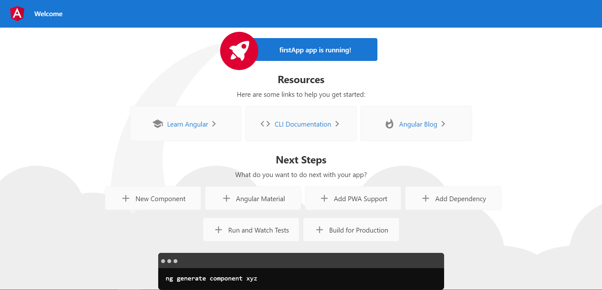

## 第一個專案

### 根元素 AppComponent

Angular 是 SPA 的前端框架，也就是說有個單一頁面，這單一頁面在 Angular 專案中是 `index.html` :

``` html
<!doctype html>
<html lang="en">

<head>
    <meta charset="utf-8">
    <title>FirstApp</title>
    <base href="/">
    <meta name="viewport" content="width=device-width, initial-scale=1">
    <link rel="icon" type="image/x-icon" href="favicon.ico">
</head>

<body>
    <app-root></app-root>
</body>

</html>
```



雖然在瀏覽器上看到的畫面是如此，然而實際去看 `index.html` 的原始檔案，並不會看到畫面上的這些元素，原因在於有個 `<app-root></app-root>` tag，這個 tag 所代表的其實是另外三個檔案 :

``` 
|--app
   |--app.component.css
   |--app.component.html
   |--app.component.ts
```

這三個檔案是個 Component ( 一個 Component 由動態的 `.ts` 、靜態的 `.html` 、編寫樣式的 `.css` 來組成，先有這樣的概念就好 )。來看看 `app.component.ts` :

``` TypeScript
@Component({
  selector: 'app-root',
  templateUrl: './app.component.html',
  styleUrls: ['./app.component.css']
})
export class AppComponent {
  title = 'firstApp';
}
```

重點在 `@Component` 內部的 `selector: 'app-root'` ，這讓 `index.html` 的 `<app-root></app-root>` 可以抓到 AppComponent，並讓 `index.html` 渲染出此 Component 的內容，先記住這個結果，之後會再次提到這個部分。

### 動態渲染畫面

在靜態畫面 `app.component.html` 上，會有些特別的寫法，例如 `<span>{{ title }} app is running!</span>` 這段程式碼，有個 `{{}}` 的語法將 `app.component.ts` 的內容綁定到 `app.component.html` 中，之後還有其他的 Angular 語法也是一樣讓靜態的 `.html` 檔與動態的 `.ts` 檔會有所互動，然而實際上這些檔案對於瀏覽器來說，是不能直接執行的，因此會有個轉換，將這些東西轉換成另一個 JavaScript 的檔案，如果按下右鍵來看網頁原始碼，應該會看到下面的程式碼 :

``` html
<!doctype html>
<html lang="en">
<head>
    <meta charset="utf-8">
    <title>FirstApp</title>
    <base href="/">
    <meta name="viewport" content="width=device-width, initial-scale=1">
    <link rel="icon" type="image/x-icon" href="favicon.ico">
</head>
<body>
    <app-root></app-root>
<script src="runtime.js" defer></script><script src="polyfills.js" defer></script><script src="styles.js" defer></script><script src="vendor.js" defer></script><script src="main.js" defer></script></body>
</html>
```

注意到下面的 `<script>`，Angular 發送回應送到前端瀏覽器時，有將 Component 的內容重新編譯，轉換成其他 `.js` 檔，這些檔案會一併送到前端，將我們剛剛編寫的 `app.component.html` 以動態渲染的方式呈現在網頁上，如果打開開發人員工具，可以看到這些編譯的檔案也一併存在於前端。

### main.js 啟動整個 Angular 專案

再看看另一個檔案 `main.js`，裡面有段相當重要的程式碼 :

``` JavaScript
platformBrowserDynamic().bootstrapModule(AppModule)
  .catch(err => console.error(err));
```

這段程式碼會是整個專案最先執行的程式碼，並且由 `.bootstrapModule(AppModule)` 來負責啟動整個 Angular 專案，這時可以看看 `AppModule` :

``` TypeScript
@NgModule({
  declarations: [
    AppComponent
  ],
  imports: [
    BrowserModule,
    AppRoutingModule
  ],
  providers: [],
  bootstrap: [AppComponent]
})
export class AppModule { }
```

重點在於 `bootstrap: [AppComponent]` 這段程式碼，它會將 `AppComopnent` 視為必須優先讀取的 Component，這樣 `index.html` 就可以解析 `<app-root>` 這段 tag ( 如果有其他想在 `index.html` 使用的 Component，也必須家在這個 Array 中 )，這邊接著就會連動到前面提到的根元素 AppComponent，渲染出現在的畫面。