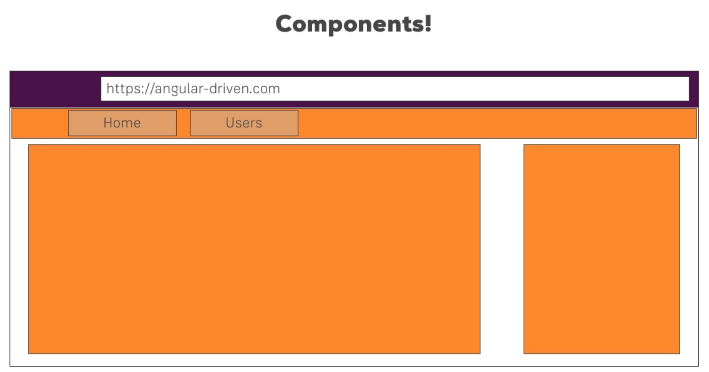

## Component



這是從 Udemy 課程截下來的內容，它呈現了 Component 的概念，撰寫前端時會將整個前端畫面切分成好幾個部分，以這畫面來說，畫面切分成上半部的選單、左邊的主要內容、以及右邊的 SideBar，這三個區塊可各自成為一個 Component，這種切 Component 的概念有幾個優勢。

* 複用性 :
當開發好一個 menuBar 元件後，可在任何的頁面或是專案中使用這個 Component，任何元件都是如此，像 PrimeNG 這樣的公司，專門開發 Angular 的 Component 讓其他 Angular 使用者來使用。

* 模組化 :
如果注意到前面使用 Component 的方式，會發現有點像使用 html tag，如果從抽象層面上來看，可以把它視為使用者自行定義的 html tag，這樣的抽象想法讓使用者不用在乎這個 tag 內部的實作為何，只要使用它就好，就像是使用 `<input value="">` 這樣的 html tag 時，使用時不會在意瀏覽器怎麼實做這個 tag，而是在想要使用輸入框時直接寫下這個 tag。

### 產生以及使用Component

使用 Angular CLI 指令 `ng g component Component名稱`，可以產生出 Component，這時會有個資料夾，資料夾有底下的目錄結構 :

``` 
|--server
    |--server.component.css
    |--server.component.html
    |--server.component.spec.ts
    |--server.component.ts
```

`.css`、`.html`、`.ts` 不需額外提，而 `.spec.ts` 是測試用的檔案，目前不會用到。接著來看看這指令帶給 Angular 專案有著什麼樣的改變 :

### `server.component.ts` :
``` TypeScript
import { Component, OnInit } from '@angular/core';

@Component({
    selector: 'app-server',
    templateUrl: './server.component.html',
    styleUrls: ['./server.component.css']
})
export class ServerComponent implements OnInit {

    constructor() { }

    ngOnInit(): void {
    }

}
```
先不論 `implements OnInit` 這段程式碼想完成的事情，觀察 `class` 的部分以及上面的 Decorator `@Component`。當創造出 class 後，Angular 會將這個 class 實例化，並且由 `export` 語法讓外部的其他檔案可以使用它。而上面的 `@Component` 有三個屬性 `selector`、`templateUrl`、`styleUrls`，`selector` 設定外部其它的 html 若想使用這個 Component，應該使用什麼樣的名稱才可以抓到，`templateUrl` 設定靜態 `.html` 的路徑，`styleUrls` 設定樣式 `.css` 的路徑，最上方的 `import` 則是 TypeScript 自己的特色 ( 跟 Angular 本身並沒有關係 )，要 `import` 有使用到的檔案。而除了 `templateUrl`，也可以使用 `template` 來編輯 inline Template，寫法就會像下面的樣子 :
``` TypeScript
@Component({
    selector: 'app-server',
    template: `<h1>
                    <div>123</div>
                </h1>`,
    styleUrls: ['./server.component.css']
})
```

當然 `styleUrls` 也可以使用 inline style :
``` TypeScript
@Component({
    selector: 'app-server',
    template: `<h1>
                    <div>123</div>
                </h1>`,
    styles: [`
        h3 {
            color: darkblue;
        }
    `]
})
```

`selector` 的運作其實就跟 CSS selector 的運作是相同的，目前這邊的寫法 `selector: 'app-server'` 是使用了 element 的寫法，當然也可以使用 class 選擇器或是屬性選擇器，不過在使用時就不能直接使用 element 的方式來使用。運作方式如下 :

`selector: '.app-server'` -> `<div class="app-server"></div>`

`selector: '[app-server]'` -> `<div app-server></div>`

### `app.module.ts` :
``` TypeScript
import { BrowserModule } from '@angular/platform-browser';
import { NgModule } from '@angular/core';

import { AppRoutingModule } from './app-routing.module';
import { AppComponent } from './app.component';
import { ServerComponent } from './server/server.component';

@NgModule({
    declarations: [
        AppComponent,
        ServerComponent
    ],
    imports: [
        BrowserModule,
        AppRoutingModule
    ],
    providers: [],
    bootstrap: [AppComponent]
})
export class AppModule { }
```

在 `AppModule` 中，class 本身並沒有添加任何內容，重點在於上方的 ecorator `@NgModule`，前面已經提過 `bootstrap` 這個屬性，想要在 `index.html` 中使用的 Component 都必須先加入到這個陣列中，`providers` 在使用 Service 時再回過頭來講，而 `imports` 會放入使用到的 Module，這邊已預先 import 兩個 Angular 本身就有的 Module，以小型專案來說通常都只會使用一個自行定義的 Module，也就是這個 `AppModule`，`declarations` 中則放入整個 app 資料夾會使用到的 Component，如果沒有定義在這邊的話，Angular 沒辦法預先掃描到 Component 也就沒有辦法去使用。
