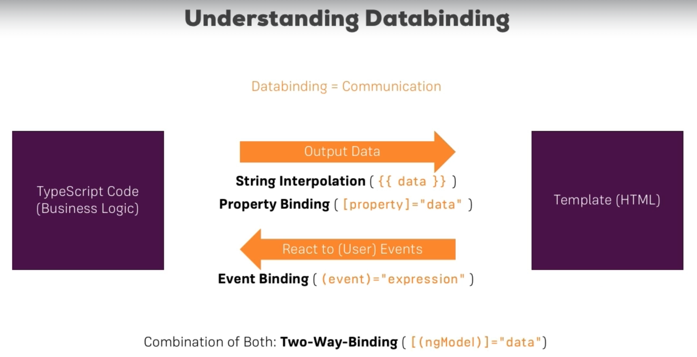

## Binding 



這是從 Udemy 課程截下來的內容，它簡單講述 Angular 的 Binding 如何運作的，對 Angular 來說它將檔案切分成兩個部分，一個是邏輯的 TypeScript、另一個是呈現的 Template，多數時候會從 TypeScript 發送請求，並將拿到的資料呈現在前端畫面上，這時會使用兩種 Binding 方式，一種是 String Interpolation ( 單純的將值送到 html 畫面上 )，一種是 Property Binding ( 設定 tag 的 property 值 )，而 user 與邏輯互動的部分則是依靠 Event Binding 來完成，最常見的是按下按鈕後對資料做出異動。最後則是結合兩者的 Two-Way-Binding，不論是畫面上的更新或是邏輯層的資料改變，兩者都會互相反應。

### String Interpolation

``` 
|--server
    |--server.component.css
    |--server.component.html // 更動
    |--server.component.ts // 更動
```

``` html
<p>{{'server'}} with ID {{serverId}} is {{getServerStatus()}}</p>
```

``` TypeScript
export class ServerComponent {
    serverId = 10;
    serverStatus = 'offline'

    getServerStatus() {
        return this.serverStatus;
    }
}
```

String Interpolation 使用 `{{}}` 將 TypeScript 的值給送過來，基本上只要回傳 String 就可以放到 `{{}}` ，因此像第一種 `{{'server'}}` 是直接將字串寫死，第二種 `{{serverId}}` 雖說是個數字，但它會自行轉型成 String，而第三種 `{{getServerStatus()}}` 則是執行 function 並將內部的字串回傳出來。另外要注意的是，這邊內部不能寫下像是 if、for 這幾種 flow control 的語法。

### Property Binding

``` 
|--servers
    |--servers.component.css // 新增
    |--servers.component.html // 新增
    |--servers.component.ts // 新增
```

``` html
<button class="btn btn-primary" [disabled]="!allowServer">Add Server</button>
<app-server></app-server>
<app-server></app-server>
```

``` TypeScript
export class ServersComponent implements OnInit {
    allowServer = false;

    constructor() {
        setTimeout(() => {
            this.allowServer = true;
        }, 2000);
    }
// ...底下省略 
```

上面的 `[disabled]="!allowServer"` 使用了 Property Binding，用法上會在想要綁定的 Property 左右加上 `[]` ，並在右邊補上 `="..."` ，以這邊來說因為 disabled 是看要不要解開這個 Property，因此綁定變數的 type 會是 boolean，可以視 Property 的情況傳入不同 type 的變數。

另外會稱這個綁定是 Property Binding 而不是 Attribute Binding，原因在於綁定的是 DOM 物件而不是 html Element，之後的章節我們會嘗試綁定在 Directive 上。

> Attribute vs. Property : https://stackoverflow.com/questions/6003819/what-is-the-difference-between-properties-and-attributes-in-html

### String Interpolation vs. Property Binding

``` html
<p>{{allowServer}}</p>
<p [[innerText]]="allowServer"></p>
```

這兩段程式碼在 Angular 中是有相同效果的，什麼時候使用 String Interpolation 什麼時候使用 Property Binding ? 在慣例上改變 Template 會使用 Interpolation，而與元素屬性有相關的則會去使用 Property Binding。

### EventBinding

``` 
|--servers
    |--servers.component.css
    |--servers.component.html // 更動
    |--servers.component.ts // 更動
```

``` html
<button class="btn btn-primary" [disabled]="!allowServer" (click)="onCreateServer()">Add Server</button>
<p>{{serverCreationStatus}}</p>
<app-server></app-server>
<app-server></app-server>
```

``` TypeScript
export class ServersComponent implements OnInit {
    allowServer = false;
    serverCreationStatus = 'No server was created!';

    constructor() {
        setTimeout(() => {
            this.allowServer = true;
        }, 2000);
    }

    ngOnInit(): void {}

    onCreateServer() {
        this.serverCreationStatus = 'Server was created!';
    }
}
```

語法上 Event Binding 為 `(click)="onCreateServer()"` ，使用 `(..)` 來代表 html Element 所想要綁定的事件，等號的右邊則放入在 TypeScript 中寫好的 function，不過也可以直接在等號右邊放入 TypeScript 述句，但通常不會這麼做，利用 function 將要做的事情封裝起來可以讓 Template 版面不會出現太多邏輯的部分。

而命名上這邊 function 會刻意加上 on 的前贅字，目的在於讓其他閱讀的人方便知道這個 function 是要綁定到 Template 上。

### Two-Way-Binding

``` 
|--servers
    |--servers.component.css
    |--servers.component.html // 更動
    |--servers.component.ts // 更動
```

``` html
<label>Server Name</label>
<input type="text" class="form-control" (input)="onUpdateServerName($event)">
<p>{{serverName}}</p>
<button class="btn btn-primary" [disabled]="!allowServer" (click)="onCreateServer()">Add Server</button>
<p>{{serverCreationStatus}}</p>
<app-server></app-server>
<app-server></app-server>
```

``` TypeScript
export class ServersComponent implements OnInit {
    allowServer = false;
    serverCreationStatus = 'No server was created!';
    serverName = '';

    constructor() {
        setTimeout(() => {
            this.allowServer = true;
        }, 2000);
    }

    ngOnInit(): void {
    }

    onCreateServer() {
        this.serverCreationStatus = 'Server was created!';
    }

    onUpdateServerName(event: Event) {
        // console.log(event);
        this.serverName = (event.target as HTMLInputElement).value;
    }
}
```

先嘗試用前面的 Interpolation 以及 Event Binding 做出類似這樣的效果，在 Template 的 input 中，寫下 `(input)="onUpdateServerName($event)"` 創造 Event Binding 綁定到邏輯層 TypeScript，這邊的 `$event` 代表將事件相關的資訊傳到 function 內。邏輯層的部分，如果把註解打開，可看到 event 裡面帶有很多屬性，input 中的 value 則在這之中 `event.target.value` 。另外這段 `(event.target as HTMLInputElement)` 是為了做轉型，因為不是每個 html Element 都有 value 屬性，所以要先告訴 Angular 它是 input Element。這就完成了類似 Two-Way-Binding 的效果，由 InputEvent 來把值帶到邏輯層的部分，再由 Interpolation 把值重新渲染到 Template 上 ( 為什麼說是類似 ? 原因在於 Event Binding 與 String Interpolation 並不是綁定到相同的元素上 )，而在 Angular 中的 Two-Way-Binding 要使用到 `[(ngModel)]`，首先要 import `FormsModule` :

``` 
|--app
    |--app.module.ts //更動
    |--servers
        |--servers.component.css
        |--servers.component.html // 更動
        |--servers.component.ts 
```

``` TypeScript
@NgModule({
    declarations: [
        AppComponent,
        ServerComponent,
        ServersComponent
    ],
    imports: [
        BrowserModule,
        FormsModule,
        AppRoutingModule
    ],
    providers: [],
    bootstrap: [AppComponent]
})
export class AppModule { }
```

再來只要更動 template 即可 :

``` html
<label>Server Name</label>
<input type="text" class="form-control" (input)="onUpdateServerName($event)">
<input type="text" class="form-control" [(ngModel)]="serverName">
<p>{{serverName}}</p>
<button class="btn btn-primary" [disabled]="!allowServer" (click)="onCreateServer()">Add Server</button>
<p>{{serverCreationStatus}}</p>
<app-server></app-server>
<app-server></app-server>
```

這樣就是 Two-Way-Binding 的效果。最後在把功能補齊全，在 TypeScript 中的 `onCreateServer(..)` 補上東西 :

``` TypeScript
export class ServersComponent implements OnInit {
    allowServer = false;
    serverCreationStatus = 'No server was created!';
    serverName = '';

    constructor() {
        setTimeout(() => {
            this.allowServer = true;
        }, 2000);
    }

    ngOnInit(): void {
    }

    onCreateServer() {
        this.serverCreationStatus = 'Server was created! Name is ' + this.serverName;
    }

    onUpdateServerName(event: Event) {
        console.log(event);
        this.serverName = (event.target as HTMLInputElement).value;
    }
}
```
