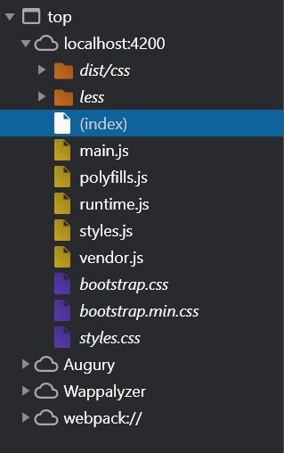
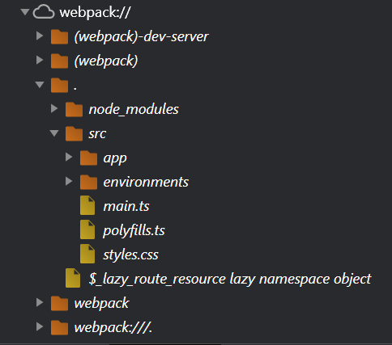
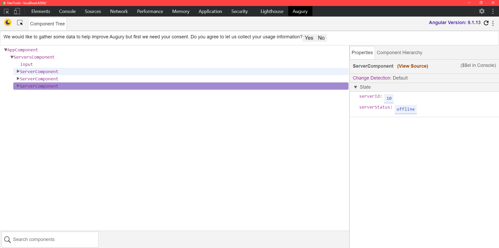

## Debugging

在 debug 上除了單純的看開發人員工具的錯誤訊息，另外可以依賴其它幾樣工具 :

* JavaScript Source Maps

這是瀏覽器內建的功能，前面提到 TypeScript 是不能直接餵給瀏覽器，因此有經過一層轉換，這層轉換把 TypeScript 轉換成 JavaScript，在開發人員工具可以看到這樣的結構 :

`main.js` 確實可以看到轉譯後的程式碼，然而不好閱讀也不好 debug，這時可以轉而點開 webpack 裡面的內容，內部就可以看到原始的 TypeScript 檔案，也可以在此下 breakPoint 來找問題 :

那為什麼已經轉換的 TypeScript 在瀏覽器會可以看到，原因在於 JavaScript Source Maps 這項內建功能可以把轉譯過的程式碼進行還原，因此在 webpack 內部可以找到本來的檔案。

* Angury

另一個工具是 Chrome 的擴充套件，載下來後在開發人員工具會多一個 Angury 的頁籤，這工具可以幫忙觀察各個 Component 之間的關係、Service 的注入、以及 Routing 的設計。

