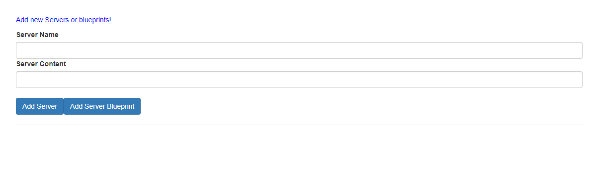
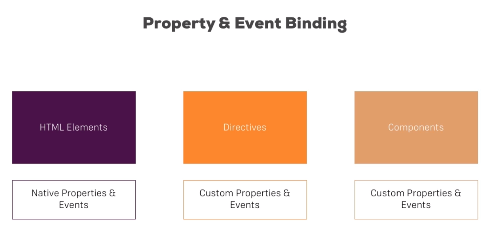
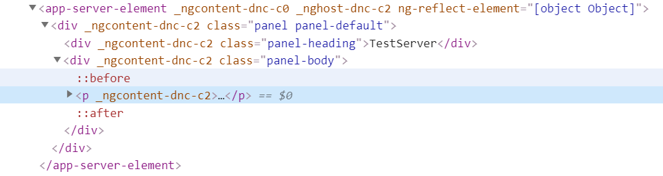

## Component的溝通



這是 Udemy 課程上某段程式碼執行後的結果，最一開始程式碼全部都寫在 AppComponent 中，再來要切分 Component，可以先自行看看畫面，決定如果是自己的話，會想怎麼拆 Component :

``` html
<div class="container">
  <div class="row">
    <div class="col-xs-12">
      <p>Add new Servers or blueprints!</p>
      <label>Server Name</label>
      <input type="text" class="form-control" [(ngModel)]="newServerName">
      <label>Server Content</label>
      <input type="text" class="form-control" [(ngModel)]="newServerContent">
      <br>
      <button
        class="btn btn-primary"
        (click)="onAddServer()">Add Server</button>
      <button
        class="btn btn-primary"
        (click)="onAddBlueprint()">Add Server Blueprint</button>
    </div>
  </div>
  <hr>
  <div class="row">
    <div class="col-xs-12">
      <div
        class="panel panel-default"
        *ngFor="let element of serverElements">
        <div class="panel-heading">{{ element.name }}</div>
        <div class="panel-body">
          <p>
            <strong *ngIf="element.type === 'server'" style="color: red">{{ element.content }}</strong>
            <em *ngIf="element.type === 'blueprint'">{{ element.content }}</em>
          </p>
        </div>
      </div>
    </div>
  </div>
</div>
```

``` TypeScript
@Component({
  selector: 'app-root',
  templateUrl: './app.component.html',
  styleUrls: ['./app.component.css']
})
export class AppComponent {
  serverElements = [];
  newServerName = '';
  newServerContent = '';

  onAddServer() {
    this.serverElements.push({
      type: 'server',
      name: this.newServerName,
      content: this.newServerContent
    });
  }

  onAddBlueprint() {
    this.serverElements.push({
      type: 'blueprint',
      name: this.newServerName,
      content: this.newServerContent
    });
  }
}
```

這邊在課程中將其拆成兩塊，分別執行指令 `ng g c cockpit --spec false`、`ng g c server-element --spec false`，產出兩個 Component，並把 AppComponent 的內容分別拆分進去 :

```
|--app
    |--app.component.css
    |--app.component.html // 更動
    |--app.component.ts // 更動    
```

``` html
<div class="container">
  <app-cockpit></app-cockpit>
  <hr>
  <div class="row">
    <div class="col-xs-12">
      <app-server-element
        *ngFor="let serverElement of serverElements"></app-server-element>
    </div>
  </div>
</div>
```

``` TypeScript
export class AppComponent {
  serverElements = [];
}
```

```
|--cockpit
    |--cockpit.component.css
    |--cockpit.component.html // 更動
    |--cockpit.component.ts // 更動    
```

``` html
<div class="row">
  <div class="col-xs-12">
    <p>Add new Servers or blueprints!</p>
    <label>Server Name</label>
    <input type="text" class="form-control" [(ngModel)]="newServerName">
    <label>Server Content</label>
    <input type="text" class="form-control" [(ngModel)]="newServerContent">
    <br>
    <button
      class="btn btn-primary"
      (click)="onAddServer()">Add Server</button>
    <button
      class="btn btn-primary"
      (click)="onAddBlueprint()">Add Server Blueprint</button>
  </div>
</div>
```

``` TypeScript
export class CockpitComponent implements OnInit {
  newServerName = '';
  newServerContent = '';

  constructor() { }

  ngOnInit() {
  }

  onAddServer() {
    // this.serverElements.push({
    //   type: 'server',
    //   name: this.newServerName,
    //   content: this.newServerContent
    // });
  }

  onAddBlueprint() {
    // this.serverElements.push({
    //   type: 'blueprint',
    //   name: this.newServerName,
    //   content: this.newServerContent
    // });
  }
}
```

```
|--server-element
    |--server-element.component.css
    |--server-element.component.html // 更動
    |--server-element.component.ts // 更動    
```

``` html
<div
        class="panel panel-default">
        <div class="panel-heading">{{ element.name }}</div>
        <div class="panel-body">
          <p>
            <strong *ngIf="element.type === 'server'" style="color: red">{{ element.content }}</strong>
            <em *ngIf="element.type === 'blueprint'">{{ element.content }}</em>
          </p>
        </div>
      </div>
```

``` TypeScript
@Component({
  selector: 'app-server-element',
  templateUrl: './server-element.component.html',
  styleUrls: ['./server-element.component.css']
})
export class ServerElementComponent implements OnInit {

  constructor() { }

  ngOnInit() {
  }

}
```
拆成這樣後應該會有些問題在，不過後面的章節會再回來看。

### 由另一個角度切入 Property Binding & Event Binding


這張圖是從 Udemy 截下來的圖片，所想表達的是種類比，寫前端最熟悉不過的就是對 html Element 做操作，利用 html 的屬性告訴 Element 希望它呈現的樣式，利用 html 的 Event 反過來告訴我們有使用者在對 Element 做操作，這是單一 html Element 的概念。然而如果由比較抽象的角度來看，Component 也可以用這樣的想法去看待，畢竟 Component 就像是我們自行客製的 html Element，在 Angular 中是使用 `@Input`、`@Output` 來進行這樣的配置。

### @Input

剛切完 Component 有兩段地方有問題，第一個是 `cockpit.component.ts` 裡面的 function，它需要用到的 `serverElements` 陣列故意把它放在 AppComponent，之後會用其他方法來拿到，因此這段先把它註解起來，晚點再來看。另一個地方是 `server-element.component.html`，這裡面本來要使用 `*ngFor` 迭代出來的東西，也因為放在 AppComponent 而取不到，先從這邊下手 :

```
|--app
    |--app.component.html // 更動
    |--server-element
        |--server-element.component.css
        |--server-element.component.html
        |--server-element.component.ts // 更動   
```

``` html
<div class="container">
  <app-cockpit></app-cockpit>
  <hr>
  <div class="row">
    <div class="col-xs-12">
      <app-server-element
        *ngFor="let serverElement of serverElements"
        [element]="serverElement"></app-server-element>
    </div>
  </div>
</div>
```

``` TypeScript
export class ServerElementComponent implements OnInit {
  @Input()element: {type: string, name: string, content: string};

  constructor() { }

  ngOnInit() {
  }

}
```

在 `<app-server-element>` 加上一個 Property Binding 的語法，藉此把 `*ngFor` 中的 `serverElement` 綁定到 `ServerElementComponent` 內的 `element`，而 `ServerElementComponent` 內的 element 除了定義它的物件型別外，前面還加上 `@Input()` 代表值是從外部帶進來的。如果希望更改此 Component 的 Property 名稱，可以在 `@Input()` 中的小括號加上別名。像是 `@Input(svcElement)` -> `<app-server-element [svcElement]="serverElement"></app-server-element>`。

### @Output

前面碰到的問題在這邊要用 `@Output` 來解決 :

``` 
|--app
    |--app.component.html // 更動
    |--app.component.ts // 更動
    |--cockpit
        |--cockpit.component.ts // 更動   
```
 
``` html
<div class="container">
  <app-cockpit
    (serverCreated)="onServerAdded($event)"
    (blueprintCreated)="onBlueprintAdded($event)"></app-cockpit>
  <hr>
  <div class="row">
    <div class="col-xs-12">
      <app-server-element
        *ngFor="let serverElement of serverElements"
        [element]="serverElement"></app-server-element>
    </div>
  </div>
</div>
```

``` TypeScript
export class AppComponent {
  serverElements = [{type: 'server', name: 'TestServer', content: 'Just a test!'}];

  onServerAdded(serverData: {serverName: string, serverContent: string}) {
    this.serverElements.push({
      type: 'server',
      name: serverData.serverName,
      content: serverData.serverContent
    });
  }

  onBlueprintAdded(blueprintData: {serverName: string, serverContent: string}) {
    this.serverElements.push({
      type: 'blueprint',
      name: blueprintData.serverName,
      content: blueprintData.serverContent
    });
  }
}
```

``` TypeScript
export class CockpitComponent implements OnInit {
  @Output() serverCreated = new EventEmitter<{serverName: string, serverContent: string}>();
  @Output() blueprintCreated = new EventEmitter<{serverName: string, serverContent: string}>();
  newServerName = '';
  newServerContent = '';

  constructor() { }

  ngOnInit() {
  }

  onAddServer() {
    this.serverCreated.emit({
      serverName: this.newServerName,
      serverContent: this.newServerContent
    });
  }

  onAddBlueprint() {
    this.blueprintCreated.emit({
      serverName: this.newServerName,
      serverContent: this.newServerContent
    });
  }
}
```

先看到 AppComponent 的 template，最主要的變動在於這段 `<app-cockpit (serverCreated)="onServerAdded($event)" (blueprintCreated)="onBlueprintAdded($event)"></app-cockpit>`，`onServerAdded($event)` 跟 `onBlueprintAdded($event)` 是會定義在 TypeScript 中的 function，那左邊的 Event Binding 呢 ? 這個是定義在 `CockpitComponent` 內部的東西晚點再來解釋，而 AppComponent 的 TypeScript 中就單純地把 `onServerAdded`、`onBlueprintAdded` 給定義好就可以，並沒有用到新的東西。

接著就是 `CockpitComponent`，重點在於一開始的變數宣告 `EventEmitter` 及 `@Output`，`EventEmitter` 是個事件發射器，只要搭配 `@Output` 跟觸發它的 `emit()` 方法，外部的 Component 就會接到 `emit()` 出來的東西。以這邊的例子來說，當按下按鈕後，就會發生 `emit()` 並把值給拋出去。而 `@Output()` 中的 `()` 其實跟 `@Input()` 的作用相同，更改對於外部 Component 所看到的事件名稱。

### ViewEncapsulation

做好上面的範例後回頭看幾個東西，首先是 `app.component.css`，前面提過它是根元件，也許自然的認為它 css Style 會影響到底下的 Component，然而實際上不會如此 :

``` css
p {
  color: blue;
}
```

底下的 `server.element.html` 內部的 `<p>` 並沒有被改變成藍色，原因在於 Angular 幫忙做了一層封裝，雖然在 `server.element.html` 內部的元素都沒有添加任何屬性，然而用開發人員工具去檢視它，會發現每個 Component 中的 html Element 都被額外添加一個 Angular 的屬性 :



這是一件好事情，如果是純粹用 JavaScript、html、css 三個文檔所組成的網頁，很常會有擔心 style 互相影響的問題，Angular 讓所有 Component 產生出來的元素都會有特有的屬性，讓它們的 style 不會有交互影響。而這樣的設定是可以變動的，只要在 Component 上增加一個新的屬性 :

``` TypeScript
@Component({
  selector: 'app-server-element',
  templateUrl: './server-element.component.html',
  styleUrls: ['./server-element.component.css'],
  encapsulation: ViewEncapsulation.Emulated //None、ShadowDom
})
```

`encapsulation` 可以設定要不要具有這種特性，`ViewEncapsulation.Emulated` 是原先的預設值、 `ViewEncapsulation.None` 則是不替 Component 添加這個額外的屬性、`ViewEncapsulation.Emulated` 則是採用瀏覽器原生提供的 ShadowDom。

### Template Reference Variable

在先前我們使用 `ngModel` 的雙向綁定，來將 template 的 input 以及 TypeScript 的變數綁定在一起，而除了這種方法外，還有種作法叫做範本參考變數，它可以賦予畫面上的元素一個變數名稱，藉此把元素傳到 TypeScript 中，也可以在 template 中的各個地方去使用 ( 如果有印象的話，`*ngIf` 的 else 有用過這個技巧 ) :

``` 
|--cockpit
    |--cockpit.component.ts // 更動   
    |--cockpit.component.html // 更動   
```

``` html
<div class="row">
  <div class="col-xs-12">
    <p>Add new Servers or blueprints!</p>
    <label>Server Name</label>
    <!-- <input type="text" class="form-control" [(ngModel)]="newServerName"> -->
    <input type="text"
            class="form-control"
            #serverNameInput>
    <label>Server Content</label>
    <input type="text" class="form-control" [(ngModel)]="newServerContent">
    <br>
    <button
      class="btn btn-primary"
      (click)="onAddServer(serverNameInput)">Add Server</button>
    <button
      class="btn btn-primary"
      (click)="onAddBlueprint(serverNameInput)">Add Server Blueprint</button>
  </div>
</div>
```

``` TypeScript
export class CockpitComponent implements OnInit {
  @Output() serverCreated = new EventEmitter<{serverName: string, serverContent: string}>();
  @Output() blueprintCreated = new EventEmitter<{serverName: string, serverContent: string}>();
  newServerName = '';
  newServerContent = '';

  constructor() { }

  ngOnInit() {
  }

  onAddServer(serverNameInput: HTMLInputElement) {
    this.serverCreated.emit({
      serverName: serverNameInput.value,
      serverContent: this.newServerContent
    });
  }

  onAddBlueprint(serverNameInput: HTMLInputElement) {
    this.blueprintCreated.emit({
      serverName: serverNameInput.value,
      serverContent: this.newServerContent
    });
  }
}
```

可以在 template 中看到其中一個 `<input>` 多了 `#serverNameInput`，並且我們把 `serverNameInput` 丟到 Event Binding 的 function 當作參數，而在 TypeScript 中，我們把參數宣告為 `HTMLInputElement`，並且將它內部的 `value` 值給取出來。

### @ViewChild()

除了利用事件傳入對於 DOM 元素的參考，還有另一種做法是 `@ViewChild()`，它可以在 TypeScript 中直接指到 template 的元素，而不必依靠事件來傳入 :

``` 
|--cockpit
    |--cockpit.component.ts // 更動   
    |--cockpit.component.html // 更動   
```

``` html
<div class="row">
  <div class="col-xs-12">
    <p>Add new Servers or blueprints!</p>
    <label>Server Name</label>
    <!-- <input type="text" class="form-control" [(ngModel)]="newServerName"> -->
    <input type="text"
            class="form-control"
            #serverNameInput>
    <label>Server Content</label>
    <!-- <input type="text" class="form-control" [(ngModel)]="newServerContent"> -->
    <input type="text"
            class="form-control"
            #serverContentInput>
    <br>
    <button
      class="btn btn-primary"
      (click)="onAddServer(serverNameInput)">Add Server</button>
    <button
      class="btn btn-primary"
      (click)="onAddBlueprint(serverNameInput)">Add Server Blueprint</button>
  </div>
</div>
```

``` TypeScript
export class CockpitComponent implements OnInit {
  @Output() serverCreated = new EventEmitter<{serverName: string, serverContent: string}>();
  @Output() blueprintCreated = new EventEmitter<{serverName: string, serverContent: string}>();
  // newServerName = '';
  newServerContent = '';
  @ViewChild('serverContentInput', {static: true}) serverContentInput: ElementRef;

  constructor() { }

  ngOnInit() {
  }

  onAddServer(serverNameInput: HTMLInputElement) {
    this.serverCreated.emit({
      serverName: serverNameInput.value,
      serverContent: this.serverContentInput.nativeElement.value
    });
  }

  onAddBlueprint(serverNameInput: HTMLInputElement) {
    this.blueprintCreated.emit({
      serverName: serverNameInput.value,
      serverContent: this.serverContentInput.nativeElement.value
    });
  }
}
```

一樣在 template 中加上範本參考變數，然後在 TypeScript 的變數前加上 `@ViewClild`，小括號內部要放入 `serverContentInput`( 範本參考變數 ) 以及 `{static: true}`，這樣就可以直接觀察到 template 中的元素，而除了指定 html Element 外，其實也可以指定自己定義的 Component。