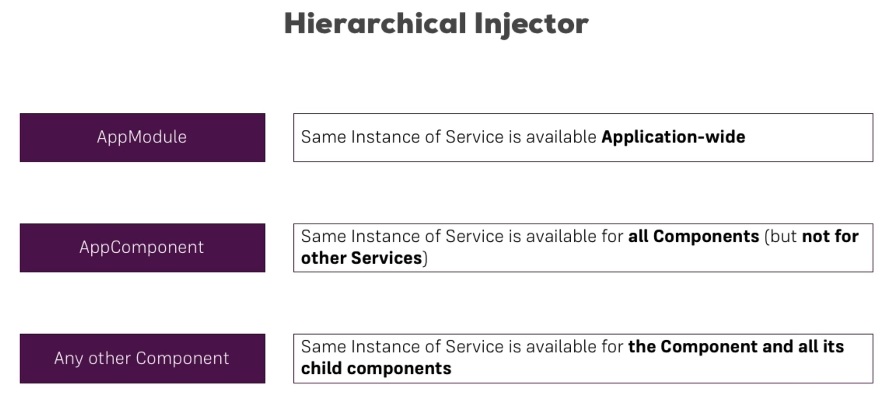

## Service


這是從 Udemy 截下來的圖片，它簡單的講述了 Service 想要解決的問題，當畫面抽出來做成一個個 Component，代表的是把重複的 UI 額外定義出來，這樣就不須寫重複的程式碼，那邏輯跟資料呢 ? 簡單來說 Service 就是為了把邏輯跟資料重複的部份抽出來，並在各個想使用此邏輯或資料的 Component 將其注入進來，以圖中的範例是把紀錄 log 這件事抽出來當成 Service，而另一個常見會抽出來當成 Service 的是發送 http 請求拿資料，畢竟雖然在不同的 Component，但還是可能要用到相同的資料。

### 注入

在 Angular 中如果想使用 Service，通常會使用注入的方式來做，也就是會將 Service 當成參數傳到 Constructor 中，此時 Angular 會自動將傳進來的參數給實例化，這樣就可以直接使用這個物件，看看程式碼的部分 :

```
|--app
    |--account
        |--account.component.ts // 更動
    |--new-account
        |--new-account.component.ts // 更動
    |--service
        |--logging-service.service.ts // 更動
```

``` TypeScript
@Component({
  selector: 'app-account',
  templateUrl: './account.component.html',
  styleUrls: ['./account.component.css'],
  providers: [LoggingService]
})
export class AccountComponent {
  @Input() account: {name: string, status: string};
  @Input() id: number;
  @Output() statusChanged = new EventEmitter<{id: number, newStatus: string}>();

  constructor(private loggingService: LoggingService) {}

  onSetTo(status: string) {
    this.statusChanged.emit({id: this.id, newStatus: status});
    this.loggingService.logStatusChange(status);
  }
}
```

``` TypeScript
@Component({
  selector: 'app-new-account',
  templateUrl: './new-account.component.html',
  styleUrls: ['./new-account.component.css'],
  providers: [LoggingService]
})
export class NewAccountComponent {
  @Output() accountAdded = new EventEmitter<{name: string, status: string}>();

  constructor(private loggingService: LoggingService){}

  onCreateAccount(accountName: string, accountStatus: string) {
    this.accountAdded.emit({
      name: accountName,
      status: accountStatus
    });
    this.loggingService.logStatusChange(accountStatus);
  }
}
```

``` TypeScript
export class LoggingService {
  logStatusChange(status: string) {
    console.log('A server status changed, new status: ' + status);
  }
}
```

首先建立一個 Service，然後將可能會重複使用的方法抽出來寫在 `LoggingService` 中，再來就是在各個 Component 中使用它，記得在 Component 中要在 Decorator 中加上 `providers` 屬性，告訴 Angular 在此 Component 中要注入的 Service，最後在 Constructor 中注入就可以使用。

### Hierarchical Injector

除了共用方法外，共用資料也可抽出來變成 Service 的一部分，這邊嘗試抽出一個 `AccountsService` :

```
|--app
    |--app.component.html // 更動
    |--app.component.ts // 更動
    |--account
        |--account.component.ts // 更動
    |--new-account
        |--new-account.component.ts // 更動
    |--service
        |--accounts.service.ts // 更動
```

``` html
<div class="container">
  <div class="row">
    <div class="col-xs-12 col-md-8 col-md-offset-2">
      <app-new-account></app-new-account>
      <hr>
      <app-account
        *ngFor="let acc of accounts; let i = index"
        [account]="acc"
        [id]="i"></app-account>
    </div>
  </div>
</div>
```

``` TypeScript
@Component({
  selector: 'app-root',
  templateUrl: './app.component.html',
  styleUrls: ['./app.component.css'],
  providers: [AccountsService]
})
export class AppComponent implements OnInit{
  accounts: {name: string, status: string}[] = [];

  constructor(private accountsService: AccountsService) {}

  ngOnInit(): void {
    this.accounts = this.accountsService.accounts;
  }
}
```

``` TypeScript
export class AccountsService {
  accounts = [
    {
      name: 'Master Account',
      status: 'active'
    },
    {
      name: 'Testaccount',
      status: 'inactive'
    },
    {
      name: 'Hidden Account',
      status: 'unknown'
    }
  ];

  onAccountAdded(name: string, status: string) {
    this.accounts.push({name: name, status: status});
  }

  onStatusChanged(id: number, newStatus: string) {
    this.accounts[id].status = newStatus;
  }
}
```

``` TypeScript
@Component({
  selector: 'app-account',
  templateUrl: './account.component.html',
  styleUrls: ['./account.component.css'],
  providers: [LoggingService]
})
export class AccountComponent {
  @Input() account: {name: string, status: string};
  @Input() id: number;

  constructor(private loggingService: LoggingService,
              private accountsService: AccountsService) {}

  onSetTo(status: string) {
    this.accountsService.onStatusChanged(this.id, status);
    this.loggingService.logStatusChange(status);
  }
}
```

``` TypeScript
@Component({
  selector: 'app-new-account',
  templateUrl: './new-account.component.html',
  styleUrls: ['./new-account.component.css'],
  providers: [LoggingService]
})
export class NewAccountComponent {
  constructor(private loggingService: LoggingService,
              private accountsService: AccountsService){}

  onCreateAccount(accountName: string, accountStatus: string) {
    this.accountsService.onAccountAdded(accountName, accountStatus)
    this.loggingService.logStatusChange(accountStatus);
  }
}
```

這邊將本來放在 `AppComponent` 中的資料及操作資料的相關方法都抽出來放入 `AccountsService` 中，然後在各個 Component 中注入此 Service 使用裡面的資料以及方法。而有個要注意的點是，只有 `AppComponent` 中的 `providers` 有 `AccountsService`，其他 Component 的 `providers` 都沒有東西，如果其他 Component 中的 `providers` 也有 `AccountsService`，畫面的運作會有一些問題，原因在於 Angular 幫我們注入 Service 是依照階層注入，也就是父元件跟子元件會是參照到同一個物件 :




### Service 的相互注入

若要把 `LoggingService` 注入到 `AccountsService` 內，程式碼要做些改動 :

```
|--app
    |--app.module.ts // 更動
    |--app.component.ts // 更動
    |--account
        |--account.component.ts // 更動
    |--new-account
        |--new-account.component.ts // 更動
    |--service
        |--accounts.service.ts // 更動
        |--logging.service.ts // 更動
```

``` TypeScript
@NgModule({
  declarations: [
    AppComponent,
    AccountComponent,
    NewAccountComponent
  ],
  imports: [
    BrowserModule,
    FormsModule,
  ],
  providers: [AccountsService,LoggingService],
  bootstrap: [AppComponent]
})
export class AppModule { }
```

``` TypeScript
@Component({
  selector: 'app-root',
  templateUrl: './app.component.html',
  styleUrls: ['./app.component.css']
})
export class AppComponent implements OnInit{
  accounts: {name: string, status: string}[] = [];

  constructor(private accountsService: AccountsService) {}

  ngOnInit(): void {
    this.accounts = this.accountsService.accounts;
  }
}
```

``` TypeScript
@Component({
  selector: 'app-account',
  templateUrl: './account.component.html',
  styleUrls: ['./account.component.css']
})
export class AccountComponent {
  @Input() account: {name: string, status: string};
  @Input() id: number;

  constructor(private accountsService: AccountsService) {}

  onSetTo(status: string) {
    this.accountsService.onStatusChanged(this.id, status);
  }
}
```

``` TypeScript
@Component({
  selector: 'app-new-account',
  templateUrl: './new-account.component.html',
  styleUrls: ['./new-account.component.css']
})
export class NewAccountComponent {
  constructor(private accountsService: AccountsService){}

  onCreateAccount(accountName: string, accountStatus: string) {
    this.accountsService.onAccountAdded(accountName, accountStatus)
  }
}
```

``` TypeScript
export class AccountsService {
  constructor(private loggingService: LoggingService) {}

  accounts = [
    {
      name: 'Master Account',
      status: 'active'
    },
    {
      name: 'Testaccount',
      status: 'inactive'
    },
    {
      name: 'Hidden Account',
      status: 'unknown'
    }
  ];

  onAccountAdded(name: string, status: string) {
    this.accounts.push({name: name, status: status});
    this.loggingService.logStatusChange(status);
  }

  onStatusChanged(id: number, newStatus: string) {
    this.accounts[id].status = newStatus;
    this.loggingService.logStatusChange(newStatus);
  }
}
```

``` TypeScript
@Injectable()
export class LoggingService {
  logStatusChange(status: string) {
    console.log('A server status changed, new status: ' + status);
  }
}
```

這邊的改動做了幾件事情，在 `LoggingService` 的上方標記 `@Injectable()` ，表示它是可以被注入的 ( 如果沒有這個無法注入到 Service 中，不過 Component 是可以的 )，另一個就是把所有 Component 上方的 `providers` 都註解掉，改成由 `AppModule` 來統一注入，最後就是在本來各 Component 各自紀錄 log 的程式碼拔掉，改由呼叫 `AccountsService` 的方法時在記錄 log。

### Component 的溝通

利用 EventEmitter 來達成 Component 之間的相互溝通 :

``` 
|--account
    |--account.component.ts // 更動
|--new-account
    |--new-account.component.ts // 更動
|--service
    |--accounts.service.ts // 更動
```

``` TypeScript
export class AccountComponent {
  @Input() account: {name: string, status: string};
  @Input() id: number;

  constructor(private accountsService: AccountsService) {}

  onSetTo(status: string) {
    this.accountsService.onStatusChanged(this.id, status);
    this.accountsService.statusUpdated.emit(status);
  }
}
```

``` TypeScript
export class NewAccountComponent {
  constructor(private accountsService: AccountsService){
    this.accountsService.statusUpdated.subscribe(alert);
  }

  onCreateAccount(accountName: string, accountStatus: string) {
    this.accountsService.onAccountAdded(accountName, accountStatus)
  }
}
```

``` TypeScript
export class AccountsService {
  constructor(private loggingService: LoggingService) {}

  accounts = [
    {
      name: 'Master Account',
      status: 'active'
    },
    {
      name: 'Testaccount',
      status: 'inactive'
    },
    {
      name: 'Hidden Account',
      status: 'unknown'
    }
  ];

  statusUpdated = new EventEmitter<string>();

  onAccountAdded(name: string, status: string) {
    this.accounts.push({name: name, status: status});
    this.loggingService.logStatusChange(status);
  }

  onStatusChanged(id: number, newStatus: string) {
    this.accounts[id].status = newStatus;
    this.loggingService.logStatusChange(newStatus);
  }
}
```

其中一個 Component 中利用 Service 裡的 EventEmitter 發射事件，而另一個 Component 訂閱這個物件，只要它被 `emit(..)` 東西出來就會有 `alert` 視窗出現。

